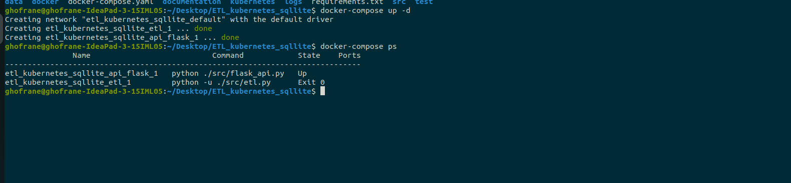
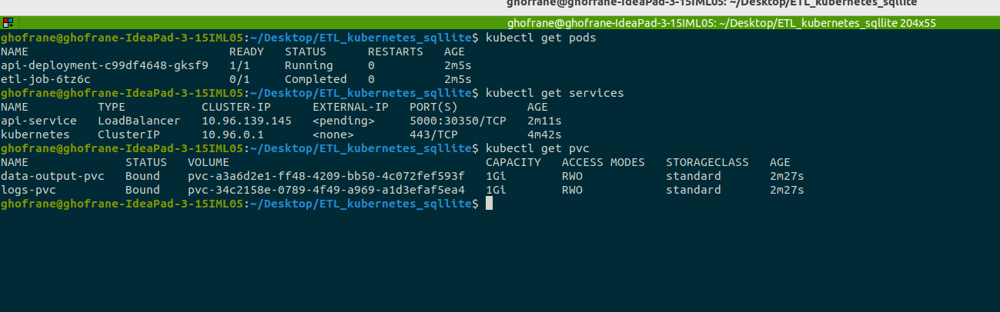
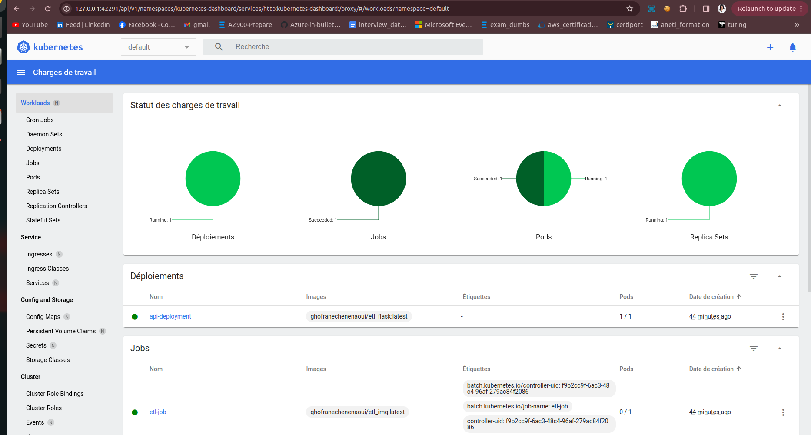
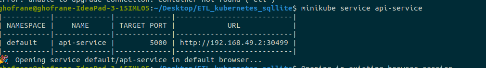
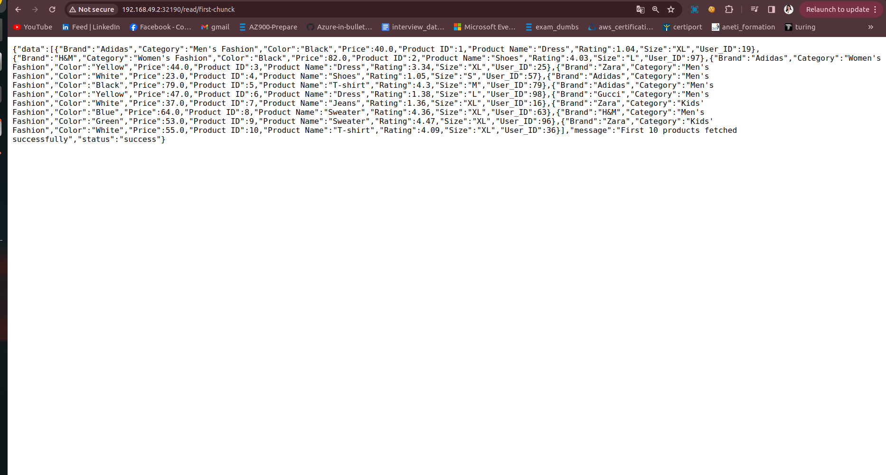
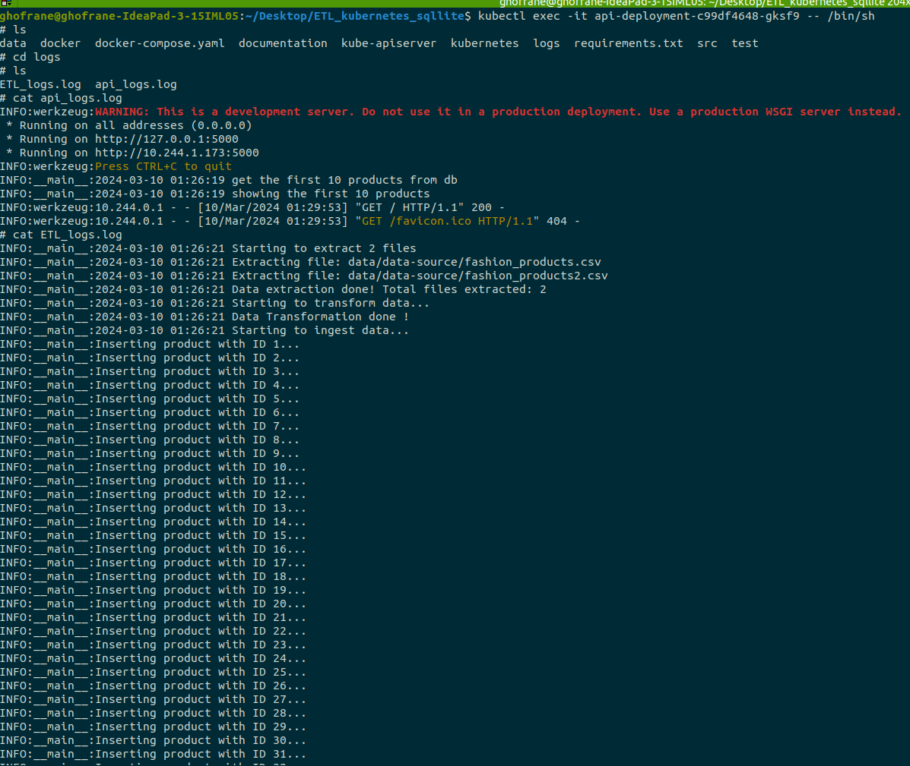

# Project Overview

This project comprises a straightforward ETL (Extract, Transform, Load) pipeline and a REST API built with Flask. The ETL pipeline ingests CSV files into a SQLite database, and the API exposes the recently ingested data by returning the first 10 lines. The solution has been uploaded and deployed on Kubernetes for seamless scalability and management.

---

## A. Installation

To run this project locally, follow these steps:

1. Clone this repository:

    ```bash
    git clone git@github.com:chenenaoui/ETL_kubernetes.git
    ```

2. Install dependencies:

    ```bash
    pip install -r requirements.txt
    ```

---

## B. Running the ETL Pipeline and API Locally

Docker Compose simplifies the orchestration of your application's containers. It is used to define and run multi-container Docker applications. The configuration is specified in a `docker-compose.yml` file. To run the ETL pipeline and API locally, follow these steps:

1. Start the Docker containers:

    ```bash
    docker-compose up -d
    ```

    This command launches the containers in detached mode, allowing them to run in the background.

2. Check the status of the containers:

    ```bash
    docker-compose ps
    ```

    This command provides information about the running containers, ensuring they are up and healthy.

    

    Access the API at [http://localhost:5000/read/first-chunck](http://127.0.0.1:5000/read/first-chunck)

3. Stop and remove the containers:

    ```bash
    docker-compose down
    ```

    This command stops and removes the running containers, freeing up resources. The Docker images used in this project are publicly available, making it easy for anyone to replicate and deploy the application. (The images are hosted on Docker Hub.)

    

---

## C. Kubernetes Deployment

1. Install Minikube and kubectl. Before deploying the application to Kubernetes, make sure you have Minikube and kubectl installed. If not, you can install them using the following commands:

    ```bash
    # Install Minikube (Linux)
    curl -LO https://storage.googleapis.com/minikube/releases/latest/minikube_latest_amd64.deb
    sudo dpkg -i minikube_latest_amd64.deb
    
    # Install kubectl (Linux)
    sudo apt-get update && sudo apt-get install -y kubectl
    ```

3. Start Minikube:

    ```bash
    minikube start
    ```

3. Deploy the application to Kubernetes:

    ```bash
    kubectl apply -f kubernetes/api-deployment.yaml
    kubectl apply -f kubernetes/etl-deployment.yaml
    kubectl apply -f kubernetes/api-service.yaml
    kubectl apply -f kubernetes/data-output-pvc.yaml
    kubectl apply -f kubernetes/logs-pvc.yaml
    ```

    These commands deploy the API, ETL, and necessary services along with persistent volume claims for data and logs.

4. Monitor the deployed resources:

    ```bash
    kubectl get pods
    kubectl get services
    kubectl get pvc
    ```

    This image shows the status of the deployed pods, services, and persistent volume claims.

    

    You can also open Minikube Dashboard for a visual representation of your cluster:

    ```bash
    minikube dashboard
    ```

    

5. Access the API service using Minikube:

    ```bash
    minikube service api-service --url
    ```

    ```bash
    minikube service api-service
    ```

    

    Expected result:

    

6. To access the pod where the Flask application is running, use:

    ```bash
    kubectl exec -it <pod_name> -- /bin/sh
    ```

    To access logs from the running pods, use the following commands:

    ```bash
    cd logs
    cat api_logs.log
    cat etl_logs.log
    ```

    

7. Delete all Kubernetes resources:

    ```bash
    kubectl delete all --all
    ```

8. Stop Minikube:

    ```bash
    minikube stop
    ```

    These commands clean up all deployed resources in the Kubernetes cluster and stop Minikube.
